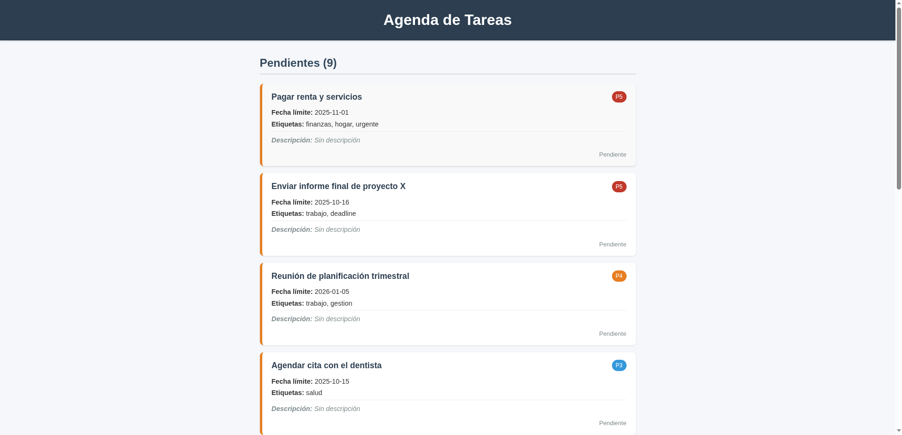
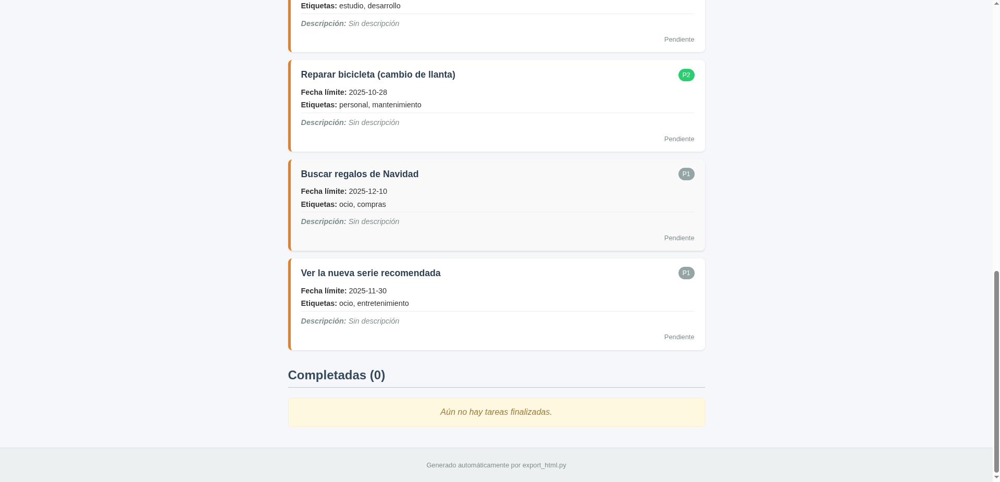

# Reporte Proyecto 2

## 1. Introducción

Este documento describe el módulo `export_html.py`, una extensión del sistema de gestión de tareas por línea de comandos (`agenda.py`).

En general costó un poco aprender a moverle al html desde python, pero creemos que salió bien.


---

## 2. Análisis de Implementación y Características Técnicas

El script `export_html.py` está escrito en Python 3 y depende de funciones definidas en `agenda.py`.

### 2.1 Funcionalidades Clave Implementadas

| Característica              | Detalle de Implementación                                                                 | Beneficio para el Usuario                                      |
|----------------------------|--------------------------------------------------------------------------------------------|----------------------------------------------------------------|
| Separación de Estado       | Filtrado en tiempo de ejecución en listas de tareas pendientes y completadas              | Claridad inmediata sobre tareas que requieren acción           |
| Ordenamiento por Prioridad | Orden descendente (`P5`, `P4`, ...) usando `t.prioridad * -1` en `sort()`                  | Priorización visual eficiente del trabajo                      |
| Visualización de Contadores| Uso de `len()` en los títulos de sección (`Pendientes (X)` y `Completadas (Y)`)           | Visión rápida del volumen de trabajo                           |
| Estilización Consistente   | Clases `.completada`, `.pendiente`, `.p-5` a `.p-1` definidas en `styles.css`              | Identificación visual clara del estado y urgencia              |
| Manejo de Lista Vacía      | Validación de lista vacía con mensaje amigable centralizado                               | Evita estructuras HTML vacías                                  |

### 2.2 Estructura de Salida (HTML y CSS)

- El archivo `index.html` es minimalista y delega la estética a `styles.css`.
- **Clases de Estado**: Uso de `border-left` y `background-color` para diferenciar tareas.
- **Contenedores de Mensajes**: `.mensaje-seccion` y `.vacio` usan fondos suaves sin librerías externas.

---

## 3. Instrucciones Detalladas para la Ejecución

### 3.1 Prerrequisitos

- Scripts: `agenda.py`, `export_html.py`, `styles.css` en el mismo directorio.
- Ya se añadió el archivo json con un ejemplo de tareas, pero debe de tenerse (si es que lo borró o cambió)
- Archivo de datos: `.tareas.json` con tareas registradas.

### 3.2 Paso 1: Ejecutar la Exportación

```bash
python3 export_html.py
```

**Salida esperada:**

```
Archivo 'index.html' generado correctamente.
```


---

## 4. Resultado Visual 

### 4.1 Resultado y Captura de Pantalla

El archivo `index.html` ofrece una interfaz limpia y organizada, separando claramente las secciones **Pendientes** y **Completadas**.



Ahora, parte final de las tareas, incluye las tareas completadas : 



---
